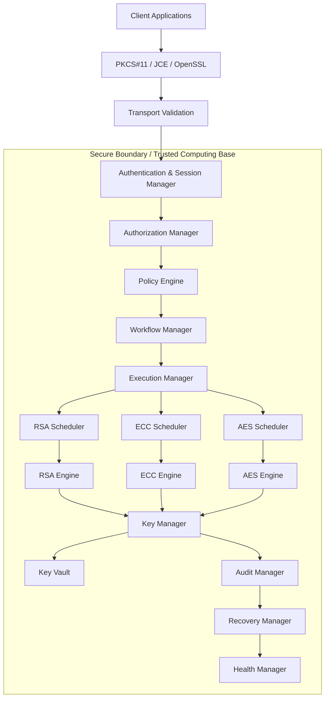

# MiniHSM Architecture

---

# 1. Purpose

MiniHSM is an educational implementation of a Hardware Security Module (HSM)
designed to explore the architectural principles behind enterprise-grade
CloudHSM solutions.

The objective is not to build a FIPS-certified product, but to understand
how modern HSMs manage cryptographic operations, protect keys, enforce
security policies, and provide high availability.

---

# 2. Design Goals

## Functional Requirements

- Secure key generation
- Secure key storage
- Cryptographic operations
- Key lifecycle management
- PKCS#11-like interface
- Audit logging
- Recovery after failures

## Non-Functional Requirements

- Security-first architecture
- High throughput
- Low latency
- High availability
- Recoverability
- Scalability
- Minimal Trusted Computing Base
- Modular design

# 3. High-Level Architecture

The following block diagram illustrates the main control and cryptographic components in MiniHSM:

# 4. Architectural Principles

1. Secrets never leave the Key Vault.

2. Metadata is managed separately from secret material.

3. Authentication, Authorization and Policy are independent concerns.

4. Every security operation must be auditable.

5. Every transaction must be recoverable.

6. Minimize the Trusted Computing Base.

7. Fail Secure.

8. Every module owns its own state.

9. Build for future algorithms.

10. Separate orchestration from cryptographic computation.