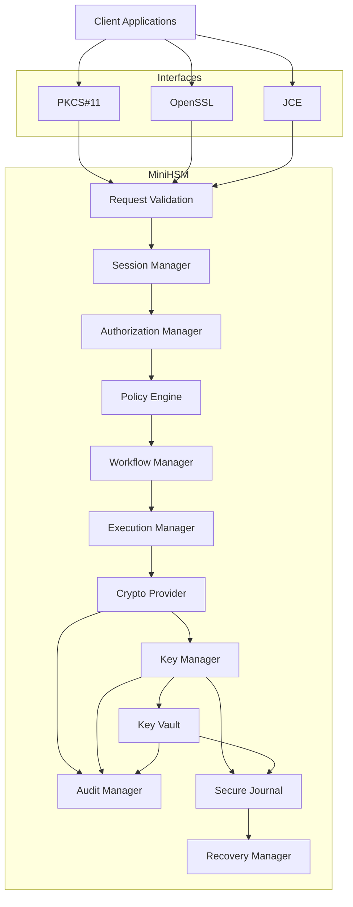

# 01. High-Level Architecture

# MiniHSM High Level Architecture

```mermaid
flowchart TB

A[Client Applications]

subgraph Interfaces
B[PKCS#11]
C[OpenSSL]
D[JCE]
end

A --> B
A --> C
A --> D

B --> E
C --> E
D --> E

subgraph MiniHSM

E[Request Validation]

F[Session Manager]

G[Authorization Manager]

H[Policy Engine]

I[Workflow Manager]

J[Execution Manager]

K[Crypto Provider]

L[Key Manager]

M[Key Vault]

N[Audit Manager]

O[Recovery Manager]

P[Secure Journal]

end

E --> F
F --> G
G --> H
H --> I
I --> J
J --> K

K --> L
L --> M

K --> N
L --> N
M --> N

L --> P
M --> P

P --> O
```