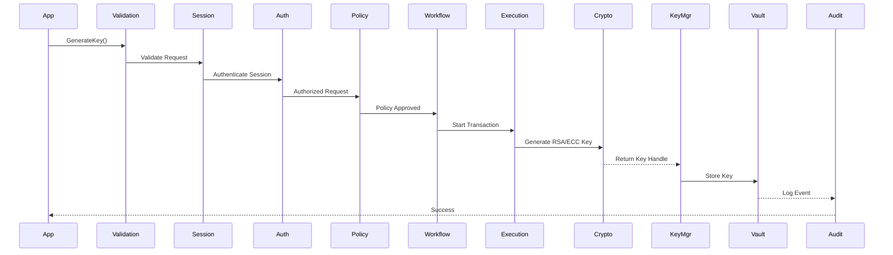

# 02. Request Runtime Flow
# GenerateKey Runtime Flow

```mermaid
sequenceDiagram

participant App
participant Validation
participant Session
participant Auth
participant Policy
participant Workflow
participant Execution
participant Crypto
participant KeyMgr
participant Vault
participant Audit

App->>Validation: GenerateKey()

Validation->>Session: Validate Request

Session->>Auth: Authenticate Session

Auth->>Policy: Authorized Request

Policy->>Workflow: Policy Approved

Workflow->>Execution: Start Transaction

Execution->>Crypto: Generate RSA/ECC Key

Crypto-->>KeyMgr: Return Key Handle

KeyMgr->>Vault: Store Key

Vault-->>Audit: Log Event

Audit-->>App: Success
```