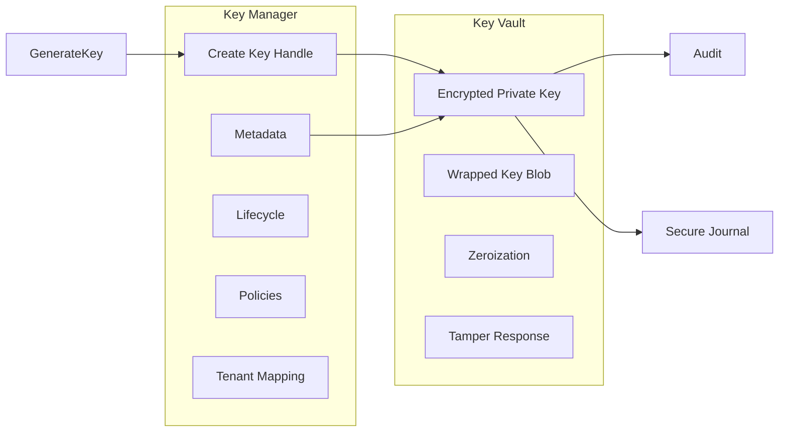

# 03. Key Management
# Key Manager vs Key Vault

```mermaid
flowchart LR

A[GenerateKey]

A --> B

subgraph Key Manager

B[Create Key Handle]

C[Metadata]

D[Lifecycle]

E[Policies]

F[Tenant Mapping]

end

subgraph Key Vault

G[Encrypted Private Key]

H[Wrapped Key Blob]

I[Zeroization]

J[Tamper Response]

end

B --> G
C --> G

G --> K[Audit]

G --> L[Secure Journal]
```