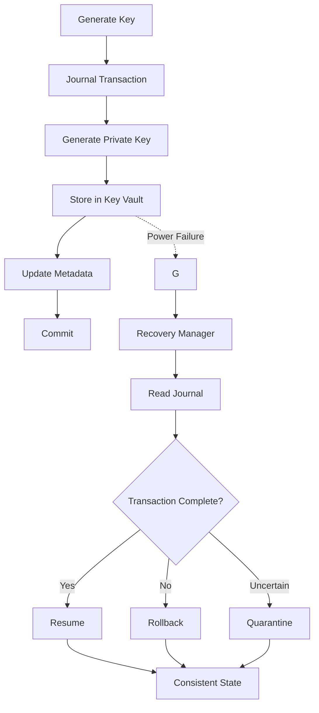

# 04. Recovery Architecture
# Recovery Architecture

```mermaid
flowchart TD

A[Generate Key]

A --> B[Journal Transaction]

B --> C[Generate Private Key]

C --> D[Store in Key Vault]

D --> E[Update Metadata]

E --> F[Commit]

D -.Power Failure.-> G

G --> H[Recovery Manager]

H --> I[Read Journal]

I --> J{Transaction Complete?}

J -->|Yes| K[Resume]

J -->|No| L[Rollback]

J -->|Uncertain| M[Quarantine]

K --> N[Consistent State]

L --> N

M --> N
```