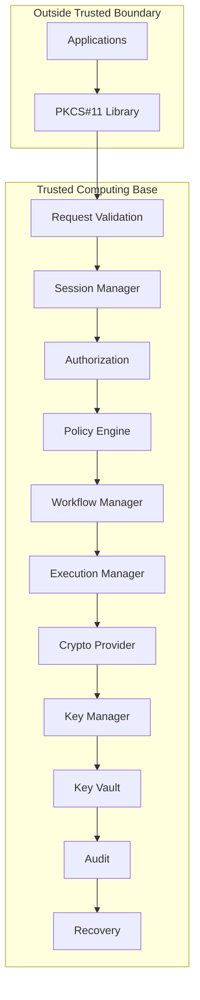

# 05. Trust Boundary

# Trusted Computing Boundary

```mermaid
flowchart TB

subgraph Outside_TCB["Outside Trusted Boundary"]

A[Applications]

B[PKCS#11 Library]

end

subgraph Inside_TCB["Trusted Computing Base"]

C[Request Validation]

D[Session Manager]

E[Authorization]

F[Policy Engine]

G[Workflow Manager]

H[Execution Manager]

I[Crypto Provider]

J[Key Manager]

K[Key Vault]

L[Audit]

M[Recovery]

end

A --> B

B --> C

C --> D

D --> E

E --> F

F --> G

G --> H

H --> I

I --> J

J --> K

K --> L

L --> M
```